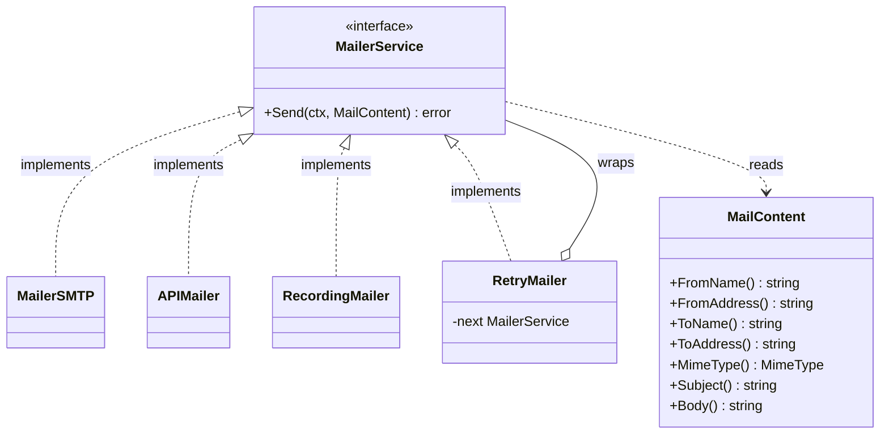

# Custom backend example

The `MailService` queue and worker pool are transport-agnostic. To deliver
through something other than the built-in transports — another provider API
(Amazon SES, SendGrid, Postmark), a message bus, or a test double — implement
the `MailerService` interface:

> Mailgun no longer needs this: `MailerMailgun` ships with the library. Read it
> (`mailgun.go`) as a worked example of everything below.

```go
type MailerService interface {
	Send(ctx context.Context, content MailContent) error
}
```



The `RetryMailer` above shows the recommended way to layer policy: a
`MailerService` that **wraps** another one (see "Layer policy by wrapping").

`MailContent` is immutable and exposes read accessors, so your backend can read
every field it needs:

```go
content.FromName()      // string
content.FromAddress()   // string
content.ToName()        // string
content.ToAddress()     // string
content.MimeType()      // mailer.MimeType (text/plain | text/html)
content.Subject()       // string
content.Body()          // string
```

## Example: an HTTP API backend

```go
package mailx

import (
	"bytes"
	"context"
	"encoding/json"
	"fmt"
	"net/http"

	"github.com/slashdevops/mailer"
)

// APIMailer delivers messages through a hypothetical JSON email API.
type APIMailer struct {
	Endpoint string
	APIKey   string
	Client   *http.Client
}

// Send implements mailer.MailerService.
func (m *APIMailer) Send(ctx context.Context, content mailer.MailContent) error {
	payload, err := json.Marshal(map[string]string{
		"from":         fmt.Sprintf("%s <%s>", content.FromName(), content.FromAddress()),
		"to":           fmt.Sprintf("%s <%s>", content.ToName(), content.ToAddress()),
		"subject":      content.Subject(),
		"content_type": content.MimeType().String(),
		"body":         content.Body(),
	})
	if err != nil {
		return err
	}

	req, err := http.NewRequestWithContext(ctx, http.MethodPost, m.Endpoint, bytes.NewReader(payload))
	if err != nil {
		return err
	}
	req.Header.Set("Authorization", "Bearer "+m.APIKey)
	req.Header.Set("Content-Type", "application/json")

	resp, err := m.Client.Do(req)
	if err != nil {
		return err
	}
	defer resp.Body.Close()

	if resp.StatusCode >= http.StatusBadRequest {
		return fmt.Errorf("email API returned status %d", resp.StatusCode)
	}
	return nil
}
```

Wire it into the service exactly like the SMTP backend:

```go
service, err := mailer.NewMailService(&mailer.MailServiceConfig{
	WorkerCount: 8,
	QueueSize:   512,
	Mailer:      &mailx.APIMailer{Endpoint: endpoint, APIKey: key, Client: http.DefaultClient},
})
```

## Guidelines for a robust backend

- **Honor the context.** Pass `ctx` to every network call so `MailServiceConfig.Timeout` and shutdown propagate.
- **Return meaningful errors.** They are logged by the workers; wrap the cause so `errors.Is`/`errors.As` work upstream.
- **Be safe for concurrent use.** Workers call `Send` from multiple goroutines simultaneously — share an `*http.Client`, avoid per-call global mutation.
- **Layer policy by wrapping.** Implement retries, circuit breaking, or dead-letter handling in a `MailerService` that wraps another one, keeping the queue simple.

## Example: a retrying wrapper

```go
// RetryMailer retries a wrapped MailerService with a fixed backoff.
type RetryMailer struct {
	Next     mailer.MailerService
	Attempts int
	Backoff  time.Duration
}

func (m *RetryMailer) Send(ctx context.Context, c mailer.MailContent) error {
	var err error
	for attempt := 1; attempt <= m.Attempts; attempt++ {
		if err = m.Next.Send(ctx, c); err == nil {
			return nil
		}
		select {
		case <-ctx.Done():
			return ctx.Err()
		case <-time.After(m.Backoff):
		}
	}
	return err
}
```

Compose it around any transport — the queue is unaware of the added policy:

```go
backend := &RetryMailer{Next: smtpMailer, Attempts: 3, Backoff: time.Second}
service, _ := mailer.NewMailService(&mailer.MailServiceConfig{WorkerCount: 4, Mailer: backend})
```

## Example: a test double

```go
type RecordingMailer struct {
	mu   sync.Mutex
	Sent []mailer.MailContent
}

func (r *RecordingMailer) Send(_ context.Context, c mailer.MailContent) error {
	r.mu.Lock()
	defer r.mu.Unlock()
	r.Sent = append(r.Sent, c)
	return nil
}
```

Use a recording or mock mailer to unit-test your enqueue logic without touching
the network.
