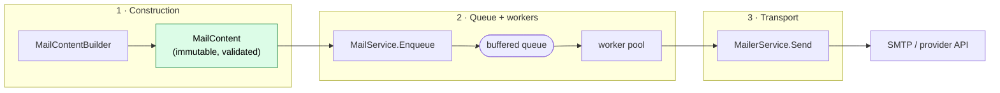
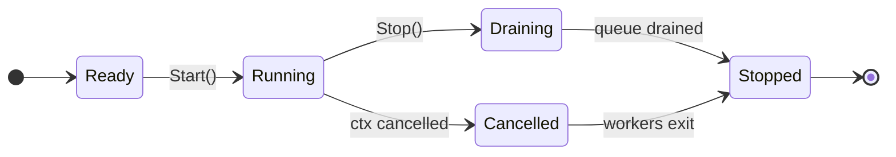
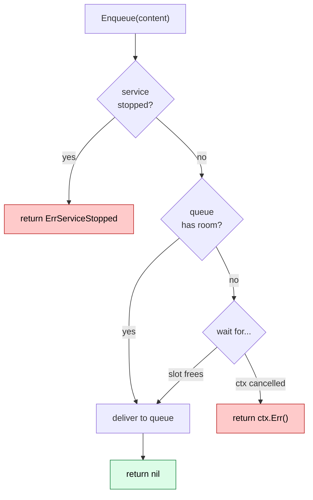
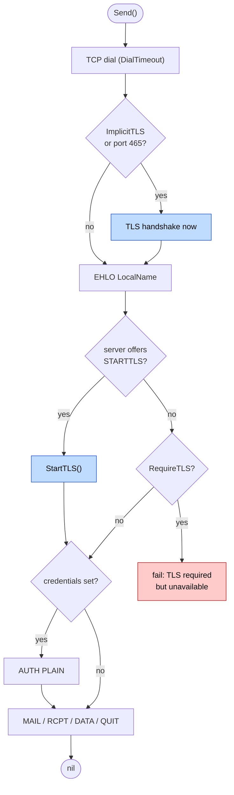

# Production guide

This guide explains how to run `mailer` in production-grade services.

## 1. Architecture overview

The package is built around three layers:

1. **Message construction and validation** — `MailContentBuilder` produces an immutable, validated `MailContent`.
2. **A queue-backed worker service** — `MailService` accepts work asynchronously and dispatches it through a pool of workers.
3. **A pluggable transport** — any implementation of `MailerService`; the package ships `MailerSMTP`.



## 2. Service lifecycle

Create the service once at startup, start the workers, and stop them during shutdown.

```go
ctx, stop := signal.NotifyContext(context.Background(), syscall.SIGINT, syscall.SIGTERM)
defer stop()

backend, err := mailer.NewMailerSMTP(mailer.MailerSMTPConf{ /* ... */ })
if err != nil {
	return err
}

service, err := mailer.NewMailService(&mailer.MailServiceConfig{
	Ctx:         ctx,
	WorkerCount: 4,
	QueueSize:   256,
	Timeout:     30 * time.Second,
	Mailer:      backend,
})
if err != nil {
	return err
}

service.Start()
defer service.Stop() // graceful: drains the queue and waits for workers
```

### Shutdown semantics

| Action | Effect |
| ------ | ------ |
| `Stop()` | Stops accepting work, closes the queue, **drains queued messages**, waits for workers. Idempotent. |
| Cancel `Ctx` | Stops workers promptly **without** draining. Use for hard shutdown. |
| `Enqueue()` after `Stop()` | Returns `ErrServiceStopped`. |
| `Enqueue()` after `Ctx` cancelled | Returns the context error. |

`Start()`, `Stop()`, and `Enqueue()` are all safe for concurrent use.



## 3. Back-pressure and queue sizing

The queue is a bounded, buffered channel with capacity `QueueSize` (defaults to `WorkerCount`). When it is full, `Enqueue` **blocks** until a worker frees a slot or the context is cancelled. This is deliberate back-pressure — the queue never grows unbounded.



- Size `QueueSize` to absorb your expected burst without blocking request handlers.
- If you cannot tolerate blocking on the request path, enqueue from a background goroutine, or wrap `Enqueue` with a bounded `select`/timeout at the call site.

## 4. Worker sizing

Choose `WorkerCount` based on volume and remote latency:

- Small services: 2–4 workers.
- Medium services: 4–8 workers.
- High-throughput systems: 8+ workers, validated with load testing.

A good starting point is the SMTP concurrency your provider allows. Most providers rate-limit concurrent connections — do not exceed that.

## 5. Per-message timeout

Set `Timeout` to bound each `Send`. Every delivery then runs with a context derived from the worker context and cancelled after the deadline, so a slow or hung SMTP server cannot stall a worker indefinitely.

## 6. SMTP transport and TLS

`MailerSMTP` supports both TLS modes:

- **Implicit TLS (SMTPS)** — set `ImplicitTLS: true` (implied for port `465`). TLS is negotiated before any SMTP command.
- **STARTTLS** — on other ports the client upgrades the plaintext connection when the server advertises `STARTTLS`.



Recommendations:

- Set `RequireTLS: true` so delivery fails instead of sending credentials or content over an unencrypted connection.
- Load credentials from environment variables or a secrets manager, never source control.
- Provide a custom `TLSConfig` only when you need pinning or a specific `MinVersion`; the default verifies the server against `SMTPHost` and requires TLS 1.2+.
- Tune `DialTimeout` to match your SLA and set `LocalName` if your provider validates the EHLO name.

```go
backend, err := mailer.NewMailerSMTP(mailer.MailerSMTPConf{
	SMTPHost:    "smtp.example.com",
	SMTPPort:    587,
	Username:    os.Getenv("SMTP_USER"),
	Password:    os.Getenv("SMTP_PASS"),
	RequireTLS:  true,
	DialTimeout: 10 * time.Second,
	LocalName:   "app-1.example.com",
})
```

## 7. Content validation and injection safety

`Build()` validates sender/recipient names and addresses, MIME type, subject, and body lengths, and **rejects CR/LF and NUL bytes in header fields** to prevent SMTP header/command injection. Always construct messages through the builder rather than assembling raw content, and treat a `*MailerError` from `Build()` as a client-side validation failure (HTTP 4xx), not a server error.

## 8. Error handling

- `Enqueue` errors mean the service is stopped (`ErrServiceStopped`) or the context is cancelled — surface them to the caller.
- `Send` errors are logged by the workers via `slog`. All transport errors are `*MailerError` and wrap the underlying cause, so `errors.Is`/`errors.As` work:

```go
var mErr *mailer.MailerError
if errors.As(err, &mErr) {
	// inspect mErr.Message / errors.Unwrap(mErr)
}
```

If you need per-message success/failure handling (retries, dead-letter queues), implement it inside a custom `MailerService` that wraps `MailerSMTP`.

## 9. Observability

The package logs through the standard `log/slog` default logger. Configure a handler at startup:

```go
slog.SetDefault(slog.New(slog.NewJSONHandler(os.Stdout, &slog.HandlerOptions{Level: slog.LevelInfo})))
```

Track, from your own instrumentation around `Enqueue`/`Send`: queue occupancy, enqueue rejections, send failures, and send latency.

## 10. Testing

The package ships unit tests covering the builder, service lifecycle, concurrency (with `-race`), and the SMTP transport against an in-process SMTP server (plain, STARTTLS, and implicit TLS). For your integration, add tests for:

- graceful shutdown with messages still queued,
- rejection of `Enqueue` after `Stop`,
- context cancellation during send,
- transport errors from your provider.

Use a mock `MailerService` for fast unit tests and a container such as [MailHog](https://github.com/mailhog/MailHog) for local end-to-end runs.

## 11. Deployment checklist

- [ ] SMTP credentials are loaded from a secret store.
- [ ] `RequireTLS` is enabled.
- [ ] `WorkerCount` and `QueueSize` are tuned for your workload and provider limits.
- [ ] `Timeout` is set to bound individual sends.
- [ ] The application has a graceful shutdown path that calls `Stop()`.
- [ ] A `slog` handler is configured and logs are shipped.
- [ ] You can observe queue depth and failure rates.
